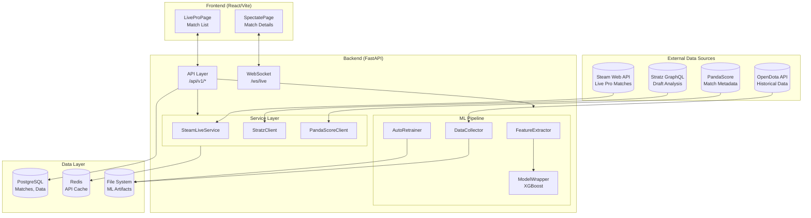

# 🌌 Chronosphere

> **Real-time Dota 2 AI Probability Engine** — Live win predictions and draft analysis for professional matches.

[](https://www.python.org/downloads/)
[](https://fastapi.tiangolo.com/)
[](https://reactjs.org/)
[](LICENSE)

---

## ✨ Features

| Feature | Description |
|---------|-------------|
| 🎮 **Live Pro Matches** | Real-time tracking of professional matches via Steam API |
| 🤖 **ML Predictions** | XGBoost model with isotonic calibration for win probabilities |
| 📊 **Draft Analysis** | Hero synergy and counter-pick impact via Stratz API |
| ⚡ **Real-time WebSockets** | Live updates pushed to frontend instantly |

---

## 🚀 Quick Start

### Prerequisites

| Tool | Version | Purpose |
|------|---------|---------|
| [Docker](https://docs.docker.com/get-docker/) | Latest | Container orchestration |
| [Python](https://www.python.org/downloads/) | 3.13+ | Backend runtime |
| [`uv`](https://github.com/astral-sh/uv) | Latest | Python package manager |
| [Node.js](https://nodejs.org/) | 18+ | Frontend build |

### 1. Clone & Configure

```bash
git clone https://github.com/yourusername/chronosphere.git
cd chronosphere
cp .env.example .env
```

Edit `.env` with your API keys (see [Environment Variables](#-environment-variables)).

### 2. Choose Your Setup

#### Option A: Full Docker Stack (Production-like)

```bash
make docker-up
# Frontend: http://localhost:3000
# API Docs: http://localhost:8000/docs
```

#### Option B: Local Development (Recommended for Contributing)

**Windows:**
```powershell
# Run commands via PowerShell script
.\dev.ps1 help          # Show all commands
.\dev.ps1 install       # Install dependencies
.\dev.ps1 services      # Start DB + Redis
.\dev.ps1 migrate       # Run migrations
.\dev.ps1 dev           # Start backend + frontend
```

**macOS/Linux:**
```bash
make help       # Show all commands
make install    # Install dependencies
make services   # Start DB + Redis
make migrate    # Run migrations
make dev        # Start backend + frontend
```

---

## 🏗️ System Architecture



### Data Flow

1. **Live Match Request** → Frontend polls `/api/v1/matches/live/pro`
2. **Steam API** → `SteamLiveService` fetches active pro matches (cached 5s)
3. **Draft Context** → `StratzClient` provides hero win rates for current picks
4. **Feature Extraction** → `FeatureExtractor` computes 19 ML features
5. **Prediction** → `ModelWrapper` runs XGBoost inference → probability
6. **Response** → JSON with teams, scores, gold/XP diff, win probabilities

---

## 🧠 Machine Learning Pipeline

Our ML system uses a **"Contextual Alpha"** strategy—combining live game state with historical context.

### Feature Categories

| Category | Features | Source |
|----------|----------|--------|
| **Time** | `game_time`, `game_time_normalized` | Steam API |
| **Economy** | `gold_diff`, `xp_diff`, `networth_velocity`, `networth_gini` | Steam API |
| **Draft** | `draft_score_diff`, `late_game_score_diff` | Stratz API |
| **Efficiency** | `carry_efficiency_index`, `buyback_power_ratio` | Computed |
| **Team Identity** | `pace_score`, `aggression_score`, `recent_winrate` | Historical |

### ML Commands

```bash
# Collect training data from OpenDota
make collect
# Runs: app/ml/collect.py → data/training_data.jsonl

# Train the XGBoost model
make train
# Runs: app/ml/train.py → data/model.pkl, data/calibrator.pkl
```

### Model Architecture

```
FeatureExtractor (app/ml/features.py)
       │ 19 features
       ▼
XGBoost Classifier (app/ml/model.py)
       │ raw probability
       ▼
Isotonic Calibration
       │ calibrated probability
       ▼
   0.0 - 1.0 (Radiant Win %)
```

---

## ⚙️ Backend Services

### External API Clients

| Service | File | Purpose |
|---------|------|---------|
| **SteamLiveService** | `app/services/steam.py` | Live pro match data |
| **StratzClient** | `app/services/stratz.py` | Draft analysis, hero stats |
| **PandaScoreClient** | `app/services/pandascore.py` | Match metadata, leagues |
| **OpenDotaCollector** | `app/ml/collect.py` | Historical match data |

### Background Workers

| Worker | File | Purpose |
|--------|------|---------|
| **AutoRetrainer** | `app/worker/retrain.py` | Weekly model retraining |

---

## 🖥️ Frontend Application

| Page | File | Description |
|------|------|-------------|
| **Home** | `src/pages/HomePage.tsx` | Landing page |
| **Live Pro** | `src/pages/LiveProPage.tsx` | Live professional matches |
| **Spectate** | `src/pages/SpectatePage.tsx` | Detailed match view |

---

## 📡 API Reference

| Method | Endpoint | Description |
|--------|----------|-------------|
| `GET` | `/api/v1/matches/live/pro` | List live pro matches with predictions |
| `GET` | `/api/v1/matches/live/pro/{id}` | Detailed match prediction |
| `WS` | `/ws/live` | WebSocket for real-time updates |

**Interactive Docs**: http://localhost:8000/docs

---

## 🛠️ Commands Reference

| Command | Description |
|---------|-------------|
| `make install` | Install all dependencies |
| `make dev` | Start full dev environment |
| `make dev-backend` | Start backend only |
| `make dev-frontend` | Start frontend only |
| `make services` | Start PostgreSQL + Redis |
| `make docker-up` | Build and start full stack |
| `make docker-down` | Stop all containers |
| `make migrate` | Run database migrations |
| `make collect` | Collect ML training data |
| `make train` | Train XGBoost model |
| `make test` | Run tests |
| `make lint` | Run linter |

---

## 🔑 Environment Variables

| Variable | Required | Description |
|----------|----------|-------------|
| `DATABASE_URL` | Yes | PostgreSQL connection |
| `REDIS_URL` | No | Redis cache connection |
| `STEAM_API_KEY` | **Yes** | [Steam Web API](https://steamcommunity.com/dev/apikey) |
| `STRATZ_API_KEY` | **Yes** | [Stratz API](https://stratz.com/api) |
| `PANDASCORE_API_KEY` | No | Match metadata |
| `OPENDOTA_API_KEY` | No | Higher rate limits |

---

## 📁 Project Structure

```
chronosphere/
├── app/                    # Backend
│   ├── api/               # Endpoints (matches.py)
│   ├── core/              # Config, DB, WebSockets
│   ├── ml/                # ML pipeline (collect, train, features)
│   ├── services/          # API clients (steam, stratz)
│   └── worker/            # Background tasks
├── frontend/              # React/Vite
├── alembic/               # Migrations
├── data/                  # ML artifacts (gitignored)
├── docker-compose.yml
├── Makefile
└── pyproject.toml
```

---

## 🤝 Contributing

1. Fork → Clone → `git checkout -b feature/my-feature`
2. `make install` → `make dev`
3. Make changes → `make test` → `make lint-fix`
4. Push → Create PR

---

## 📄 License

MIT License - see [LICENSE](LICENSE)
